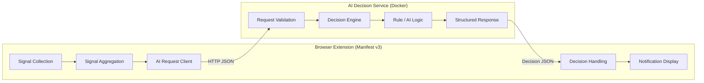
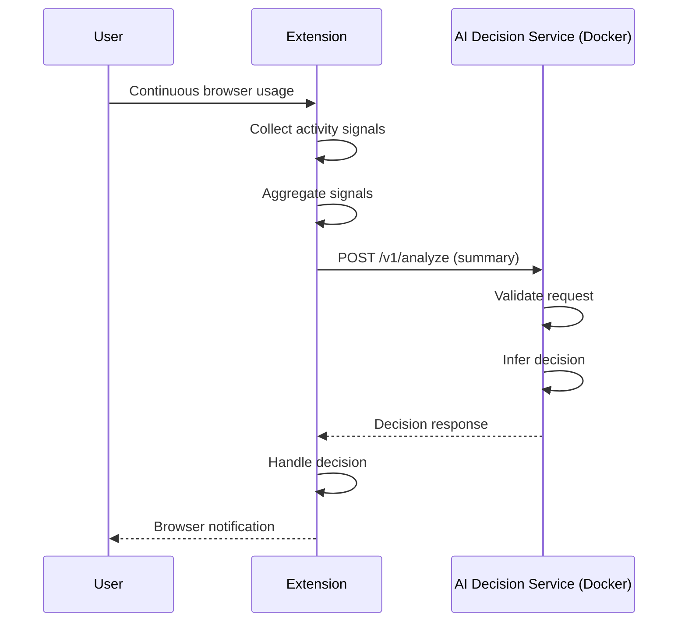
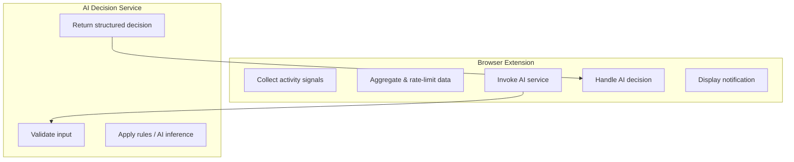

# System Design

## Design Goals
- Minimal scope with clear separation of concerns
- Privacy-first signal handling
- Replaceable AI decision logic
- Extensible interfaces

## High-Level Design (HLD)

## Sequence Diagram

## Logical Responsibility Diagram

### Architecture Overview
Browser Extension
    → Signal collection
    → Aggregation
    → AI request
    → Notification

AI Decision Service
    → Decision inference
    → Decision response

## Key Design Decisions

### Separation of Concerns
- Extension handles signal collection only
- AI service handles decision-making

### AI Usage
AI is used for inference, not prediction or profiling.

### Fallback Strategy
If AI service is unavailable, rule-based logic ensures functionality.

### Constraints
- Browser extensions require JavaScript
- Limited development time (~5 hours)
- Privacy restrictions

## Trade-offs
- Simplicity over completeness
- Inference over learning
- No persistent storage

